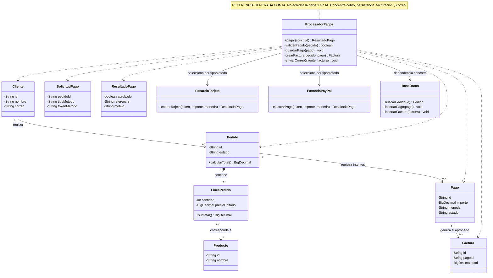

# Diseño UML y refactorización con principios SOLID

## Sistema de pagos con múltiples métodos

> Material elaborado con asistencia de IA. El diseño inicial es una referencia didáctica y no acredita la fase sin IA exigida por la consigna. Las fechas del historial son reales.

Este repositorio compara una referencia inicial de doce clases con una refactorización de dieciséis clases concretas y seis interfaces.

## Archivos

- [Referencia inicial editable](01_diseno_inicial_REFERENCIA_IA.mmd)
- [Diagrama SOLID editable](02_diseno_refactorizado_SOLID.mmd)
- [Justificación completa, contrato y requisitos](EXPLICACION_SOLID.md)

## 1. Diseño inicial de referencia

## 2. Diseño refactorizado

```mermaid
classDiagram
direction TB
class Cliente {
  -String id
  -String correo
}
class Pedido {
  -String id
  +total() BigDecimal
}
class LineaPedido {
  -int cantidad
  -BigDecimal precioUnitario
  +subtotal() BigDecimal
}
class Producto {
  -String id
  -String nombre
}
class Pago {
  -String id
  -BigDecimal importe
  -String moneda
  -String estado
  -String referencia
}
class SolicitudPago {
  -String pedidoId
  -String moneda
  -String tokenMetodo
  -String claveIdempotencia
}
class ResultadoPago {
  -boolean aprobado
  -String referencia
  -String motivo
}
class Factura {
  -String id
  -String pagoId
  -BigDecimal total
}
class ServicioPago {
  +ServicioPago(cobrador, pedidos, pagos, facturador, notificador)
  +pagar(solicitud) ResultadoPago
}
class Cobrador {
  <<interface>>
  +cobrar(importe, moneda, token, clave) ResultadoPago
}
class Reembolsador {
  <<interface>>
  +reembolsar(referencia, importe, clave) ResultadoPago
}
class AdaptadorTarjeta {
  +cobrar(importe, moneda, token, clave) ResultadoPago
  +reembolsar(referencia, importe, clave) ResultadoPago
}
class AdaptadorPayPal {
  +cobrar(importe, moneda, token, clave) ResultadoPago
  +reembolsar(referencia, importe, clave) ResultadoPago
}
class AdaptadorBono {
  +cobrar(importe, moneda, token, clave) ResultadoPago
}
class RepositorioPedidos {
  <<interface>>
  +buscar(id) Pedido
}
class RepositorioPagos {
  <<interface>>
  +buscarPorClave(clave) Pago
  +guardar(pago, clave) void
}
class RepositorioPedidosSQL {
  +buscar(id) Pedido
}
class RepositorioPagosSQL {
  +buscarPorClave(clave) Pago
  +guardar(pago, clave) void
}
class Facturador {
  <<interface>>
  +emitir(pedido, pago) Factura
}
class FacturadorSimple {
  +emitir(pedido, pago) Factura
}
class NotificadorPago {
  <<interface>>
  +notificar(cliente, pago, factura) void
}
class NotificadorEmail {
  +notificar(cliente, pago, factura) void
}
Cliente "1" --> "0..*" Pedido : realiza
Pedido "1" *-- "1..*" LineaPedido : contiene
LineaPedido "0..*" --> "1" Producto : corresponde a
Pedido "1" --> "0..*" Pago : registra intentos
Pago "1" --> "0..1" Factura : genera si aprobado
ServicioPago ..> SolicitudPago
ServicioPago ..> ResultadoPago
ServicioPago ..> Pago : crea
ServicioPago --> Cobrador : cobra mediante
ServicioPago --> RepositorioPedidos : consulta
ServicioPago --> RepositorioPagos : registra
ServicioPago --> Facturador : delega
ServicioPago --> NotificadorPago : delega
Cobrador ..> ResultadoPago
Reembolsador ..> ResultadoPago
AdaptadorTarjeta ..|> Cobrador
AdaptadorPayPal ..|> Cobrador
AdaptadorBono ..|> Cobrador
AdaptadorTarjeta ..|> Reembolsador
AdaptadorPayPal ..|> Reembolsador
RepositorioPedidosSQL ..|> RepositorioPedidos
RepositorioPagosSQL ..|> RepositorioPagos
FacturadorSimple ..|> Facturador
NotificadorEmail ..|> NotificadorPago
note for ServicioPago "S: coordina el caso de uso; delega almacenamiento, facturacion y aviso. D: recibe interfaces por constructor."
note for Cobrador "O: nuevos cobradores sin modificar ServicioPago. L: mismo contrato de entrada, resultado e idempotencia. Strategy."
note for Reembolsador "I: reembolso separado del cobro. Un bono no promete reembolsar."
note for FacturadorSimple "S: responsabilidad de facturacion."
note for NotificadorEmail "S: responsabilidad de notificacion."
note for AdaptadorBono "L: rechazos previstos se expresan como ResultadoPago, no como operacion no soportada."
```

## Aplicación de SOLID

| Principio | Aplicación |
| --- | --- |
| S | ServicioPago coordina; repositorios, facturador y notificador tienen responsabilidades separadas. |
| O | Se añade otro Cobrador sin cambiar ServicioPago. |
| L | Todos los cobradores respetan el mismo contrato de entradas, resultados, errores e idempotencia. |
| I | Cobro y reembolso son interfaces independientes. El bono solo cobra. |
| D | El servicio recibe abstracciones por constructor. |

Las notas del diagrama indican los principios en los elementos correspondientes. Strategy aparece en la relación entre ServicioPago, Cobrador y sus implementaciones.

## Historial y alcance

El repositorio se creó con un README en un commit inicial. Después se añade la referencia de diseño y, en otro commit, la refactorización. Se conserva ese historial sin reescribirlo. Esta secuencia contiene tres commits y no equivale a acreditar una primera fase realizada sin IA.

La entrega en TEMA sigue pendiente. Este trabajo documenta UML y comportamiento esperado; no incluye ni acredita una integración de pagos ejecutada.
