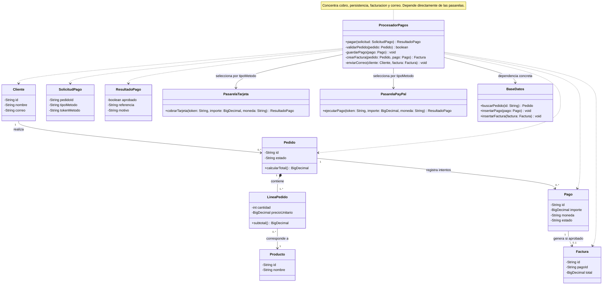

# Diseño UML y refactorización con principios SOLID

## Sistema de pagos con múltiples métodos

El proyecto compara un diseño inicial de doce clases con una versión refactorizada de dieciséis clases concretas y seis interfaces. Permite cobrar pedidos por tarjeta, PayPal o bono interno, registrar el resultado, emitir facturas y notificar al cliente.

## Documentación

- [Explicación de SOLID, contratos y decisiones](EXPLICACION_SOLID.md)
- [Fuente del diseño inicial](01_diseno_inicial.mmd)
- [Fuente del diseño refactorizado](02_diseno_refactorizado_SOLID.mmd)

## Diseño inicial

El procesador concentra cobro, persistencia, facturación y correo. Su dependencia de pasarelas concretas obliga a modificarlo cuando se agrega un medio de pago.

## Diseño refactorizado

El servicio coordina el pago mediante interfaces. Las notas señalan dónde se aplica SOLID y la relación Strategy. GitHub permite ampliar cada diagrama desde su control de visualización.

```mermaid
classDiagram
direction TB
class Cliente {
  -String id
  -String correo
}
class Pedido {
  -String id
  -String moneda
  -String estado
  +total() BigDecimal
  +marcarPagado() void
}
class LineaPedido {
  -int cantidad
  -BigDecimal precioUnitario
  +subtotal() BigDecimal
}
class Producto {
  -String id
  -String nombre
}
class Pago {
  -String id
  -BigDecimal importe
  -String moneda
  -String estado
  -String referencia
}
class SolicitudPago {
  -String pedidoId
  -String tokenMetodo
  -String claveIdempotencia
}
class ResultadoPago {
  -boolean aprobado
  -String referencia
  -String motivo
}
class Factura {
  -String id
  -String pagoId
  -BigDecimal total
}
class ServicioPago {
  -Cobrador cobrador
  -RepositorioPedidos pedidos
  -RepositorioPagos pagos
  -Facturador facturador
  -NotificadorPago notificador
  +pagar(solicitud: SolicitudPago) ResultadoPago
}
class Cobrador {
  <<interface>>
  +cobrar(importe: BigDecimal, moneda: String, token: String, clave: String) ResultadoPago
}
class Reembolsador {
  <<interface>>
  +reembolsar(referencia: String, importe: BigDecimal, clave: String) ResultadoPago
}
class AdaptadorTarjeta {
  +cobrar(importe: BigDecimal, moneda: String, token: String, clave: String) ResultadoPago
  +reembolsar(referencia: String, importe: BigDecimal, clave: String) ResultadoPago
}
class AdaptadorPayPal {
  +cobrar(importe: BigDecimal, moneda: String, token: String, clave: String) ResultadoPago
  +reembolsar(referencia: String, importe: BigDecimal, clave: String) ResultadoPago
}
class AdaptadorBono {
  +cobrar(importe: BigDecimal, moneda: String, token: String, clave: String) ResultadoPago
}
class RepositorioPedidos {
  <<interface>>
  +buscar(id: String) Optional~Pedido~
  +guardar(pedido: Pedido) void
}
class RepositorioPagos {
  <<interface>>
  +buscarPorClave(clave: String) Optional~Pago~
  +guardar(pago: Pago, clave: String) void
}
class RepositorioPedidosSQL {
  +buscar(id: String) Optional~Pedido~
  +guardar(pedido: Pedido) void
}
class RepositorioPagosSQL {
  +buscarPorClave(clave: String) Optional~Pago~
  +guardar(pago: Pago, clave: String) void
}
class Facturador {
  <<interface>>
  +emitir(pedido: Pedido, pago: Pago) Factura
}
class FacturadorSimple {
  +emitir(pedido: Pedido, pago: Pago) Factura
}
class NotificadorPago {
  <<interface>>
  +notificar(cliente: Cliente, pago: Pago, factura: Factura) void
}
class NotificadorEmail {
  +notificar(cliente: Cliente, pago: Pago, factura: Factura) void
}
Cliente "1" <-- "0..*" Pedido : pertenece a
Pedido "1" *-- "1..*" LineaPedido : contiene
LineaPedido "0..*" --> "1" Producto : corresponde a
Pedido "1" --> "0..*" Pago : registra intentos
Pago "1" --> "0..1" Factura : genera si aprobado
ServicioPago ..> SolicitudPago
ServicioPago ..> ResultadoPago
ServicioPago ..> Pago : crea
ServicioPago --> Cobrador : cobra mediante
ServicioPago --> RepositorioPedidos : consulta
ServicioPago --> RepositorioPagos : registra
ServicioPago --> Facturador : delega
ServicioPago --> NotificadorPago : delega
Cobrador ..> ResultadoPago
Reembolsador ..> ResultadoPago
AdaptadorTarjeta ..|> Cobrador
AdaptadorPayPal ..|> Cobrador
AdaptadorBono ..|> Cobrador
AdaptadorTarjeta ..|> Reembolsador
AdaptadorPayPal ..|> Reembolsador
RepositorioPedidosSQL ..|> RepositorioPedidos
RepositorioPagosSQL ..|> RepositorioPagos
FacturadorSimple ..|> Facturador
NotificadorEmail ..|> NotificadorPago
note for ServicioPago "S: coordina el caso de uso; delega almacenamiento, facturacion y aviso. D: recibe interfaces por constructor."
note for Cobrador "O: nuevos cobradores sin modificar ServicioPago. L: mismo contrato de entrada, resultado e idempotencia. Strategy."
note for Reembolsador "I: reembolso separado del cobro. Un bono no promete reembolsar."
note for FacturadorSimple "S: responsabilidad de facturacion."
note for NotificadorEmail "S: responsabilidad de notificacion."
note for AdaptadorBono "L: rechazos previstos se expresan como ResultadoPago, no como operacion no soportada."
```

## Qué mejora

| Principio | Decisión de diseño |
| --- | --- |
| Responsabilidad única | Separar coordinación, cobro, persistencia, facturación y notificación. |
| Abierto/cerrado | Incorporar nuevos cobradores sin modificar el servicio. |
| Sustitución de Liskov | Compartir contrato de entradas, resultados, errores e idempotencia. |
| Segregación de interfaces | Separar cobro y reembolso; el bono no ofrece reembolsos. |
| Inversión de dependencias | Recibir los cinco colaboradores mediante interfaces e inyección por constructor. |

## Alcance

La entrega en TEMA está pendiente. El alcance es diseño UML: no incluye una integración de pagos ejecutada.
